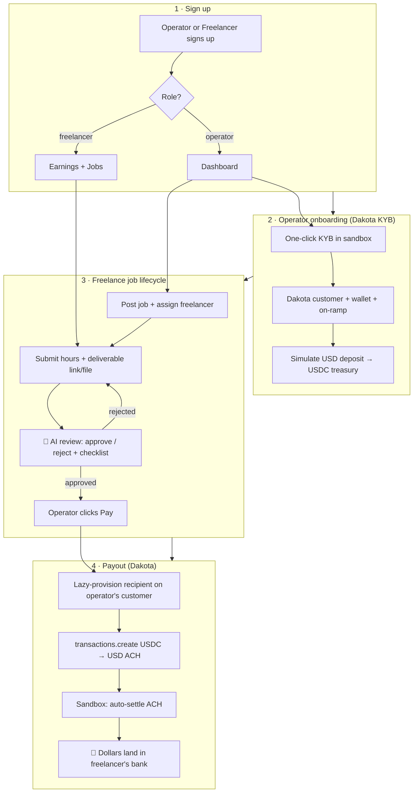
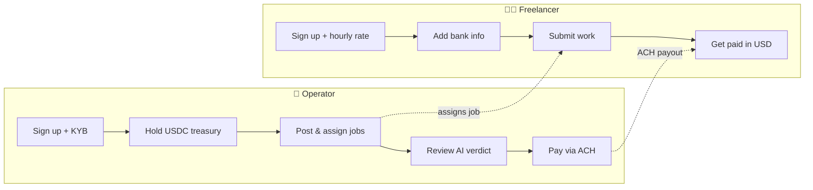
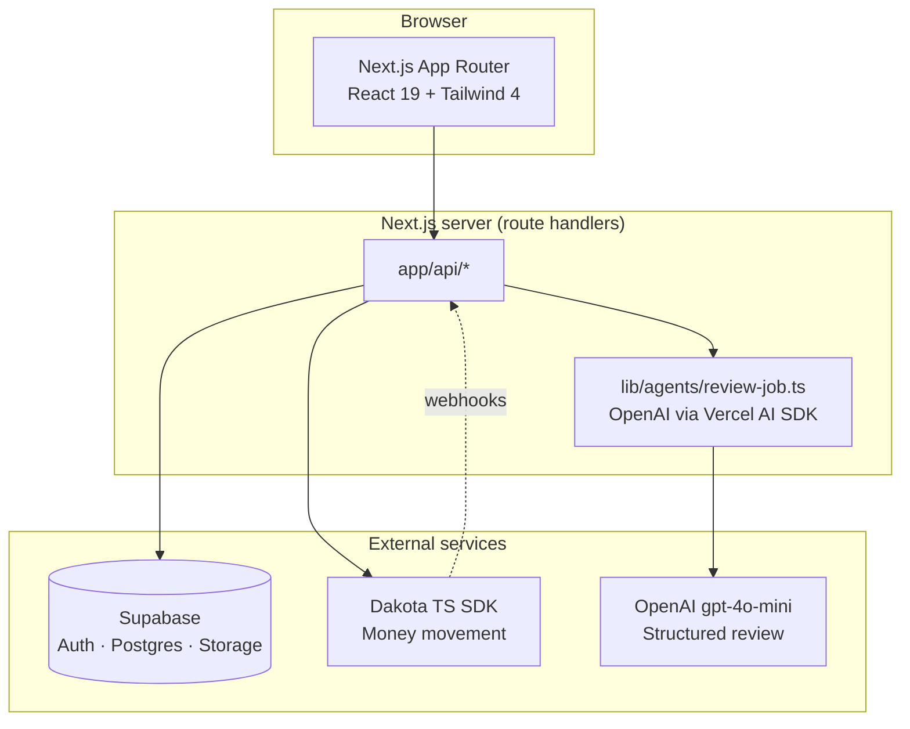
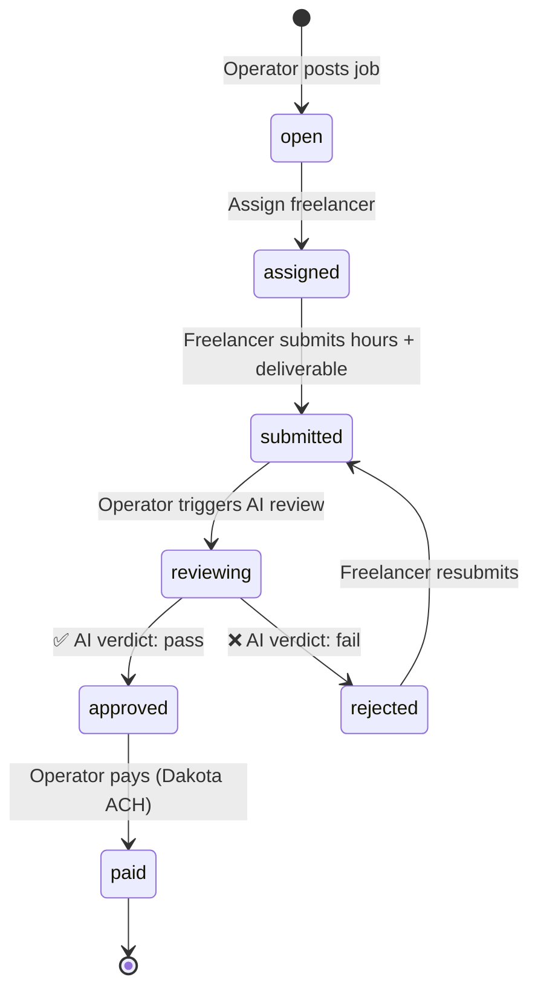
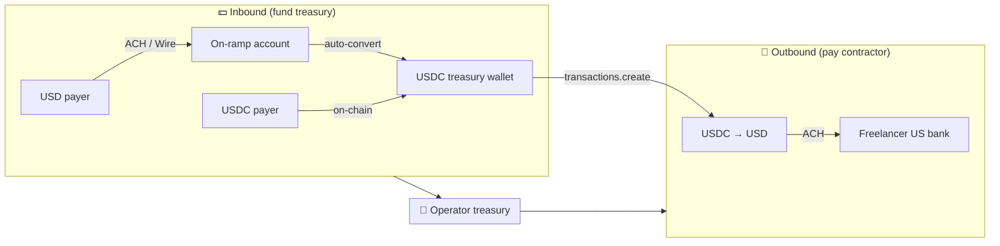
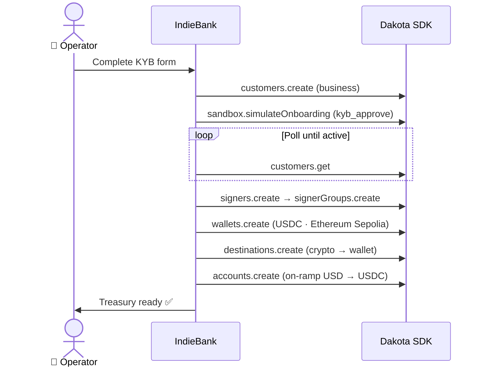
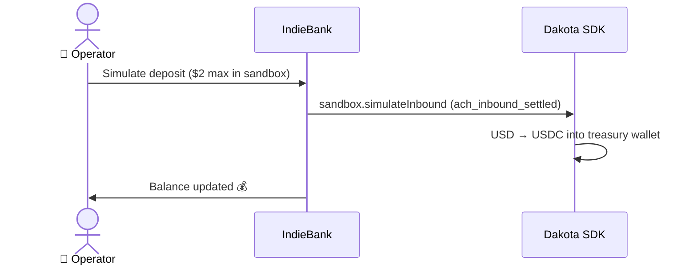
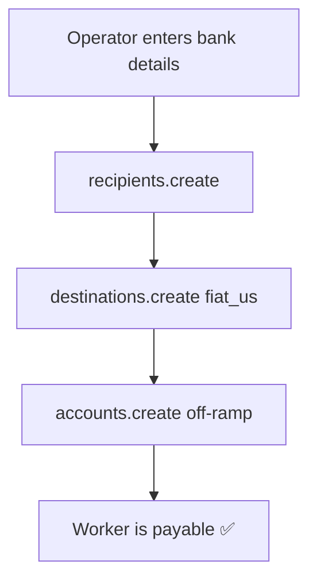
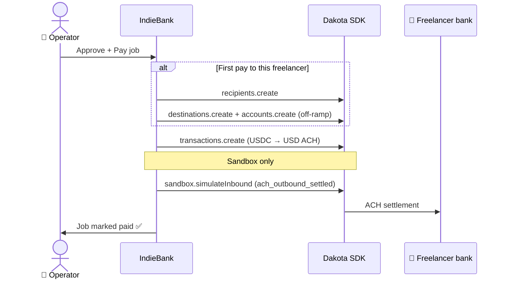
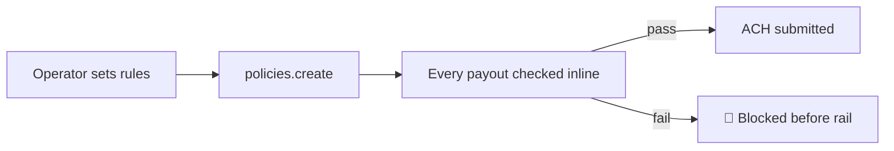

# IndieBank 🏦

Banking and freelance payments for indie operators. Built for the **[Dakota Agentic Build Challenge](https://dakota.xyz/agentic-build)**.

**🚀 Live prototype:** [indiebank-challenge.vercel.app](https://indiebank-challenge.vercel.app/)

IndieBank is a neobank console for solo founders: open a USD treasury backed by USDC, post freelance gigs, let an AI agent review every submission, and pay contractors in plain dollars via ACH — powered by [Dakota](https://dakota.xyz) under the hood.

---

## 📑 Table of contents

| Section | In this README | Deep dive on the live app |
| --- | --- | --- |
| Overview | [What IndieBank is](#-what-indiebank-is) | — |
| How it works | [End-to-end flow](#-how-it-works-end-to-end) | — |
| Roles | [Operators vs freelancers](#-two-roles-one-product) | — |
| Architecture | [System diagram](#-architecture) | [Architecture →](https://indiebank-challenge.vercel.app/challenge-details#architecture) |
| Jobs + AI | [Agent-in-the-loop payments](#-jobs--ai-review-agent-in-the-loop) | [Jobs flow spotlight →](https://indiebank-challenge.vercel.app/challenge-details#architecture) |
| Dakota flows | [All money movement](#-dakota-money-flows) | [Dakota usage →](https://indiebank-challenge.vercel.app/challenge-details#dakota) |
| Design | — | [Design →](https://indiebank-challenge.vercel.app/challenge-details#design) |
| Run locally | [Setup](#-run-locally) | [Challenge details (full write-up) →](https://indiebank-challenge.vercel.app/challenge-details) |

---

## ✨ What IndieBank is

IndieBank targets the **one-person company**: a founder who reviews their own pull requests and pays their own contractors.

| Layer | What you get |
| --- | --- |
| 💵 **Treasury** | USD on-ramp account + USDC wallet on Ethereum (via Dakota) |
| 📋 **Jobs** | Post a brief, assign a freelancer, collect submissions |
| 🤖 **AI reviewer** | OpenAI reads the brief + deliverable → structured verdict before any payout |
| 🏧 **Payouts** | USDC → USD ACH to the freelancer's US bank account |
| 🛡️ **Compliance** | Programmable payout policies enforced inline by Dakota |

---

## 🔄 How it works (end-to-end)



### 🧭 Quick walkthrough

1. **Sign up** as an **operator** or **freelancer** at [/signup](https://indiebank-challenge.vercel.app/signup).
2. **Operator** completes **KYB onboarding** → Dakota provisions a business customer, USDC treasury wallet, and USD on-ramp account.
3. **Fund the treasury** with a sandbox ACH deposit (Dashboard → simulate deposit).
4. **Post a job**, assign a freelancer, and write the requirements like a doc.
5. **Freelancer** adds bank details in Settings, submits hours + a deliverable.
6. **AI agent** returns a verdict (decision + checklist + feedback). Payment is blocked until work passes.
7. **Operator approves** → one click fires a **USDC → USD ACH** payout via Dakota.
8. **Freelancer** sees the payment in Earnings; contractor gets plain dollars in their bank.

---

## 👥 Two roles, one product



| | 👔 Operator | 🧑‍💻 Freelancer |
| --- | --- | --- |
| **Dakota customer?** | ✅ Yes — holds money | ❌ No — recipient only |
| **KYB required?** | ✅ Yes (auto-approved in sandbox) | ❌ Never |
| **Dashboard** | `/dashboard`, `/jobs`, `/compliance` | `/earnings`, `/jobs`, `/settings` |
| **Can move money?** | ✅ Pay workers & freelancers | ❌ Read-only earnings |

> Freelancers sign in to IndieBank (Supabase auth) but **never become Dakota customers**. On first pay, we lazily create a **recipient + bank destination + off-ramp** on the **operator's** Dakota customer using the freelancer's saved bank info.

---

## 🏗 Architecture



| Component | Role |
| --- | --- |
| **Next.js 16** | Server components + `app/api/*` route handlers. Dakota SDK runs **server-only**. |
| **Supabase** | Email/password auth, Postgres with RLS, file storage for submissions. |
| **OpenAI** | `generateObject` + Zod schema → typed `{ decision, feedback, checklist[] }`. |
| **Dakota** | Regulated banking + on-chain settlement. All treasury, on-ramp, off-ramp, and payout calls. |

---

## 📋 Jobs + AI review (agent-in-the-loop)

This is the differentiator: **no cent moves until the AI reads the work**.



### 🤖 What the AI returns

- **decision** — `approved` or `rejected`
- **checklist** — per-requirement pass/fail against the brief
- **feedback** — actionable notes for the freelancer

Multimodal: text/markdown/code is inlined; image deliverables are sent as vision inputs. Implemented in `lib/agents/review-job.ts`.

### 💰 Payment amount

```
amount = freelancer.hourly_rate_usd × submission.hours_worked
```

Route: `POST /api/jobs/[id]/pay`

---

## 💸 Dakota money flows

Dakota is the **money-movement layer**. IndieBank is the indie-operator console on top. USD comes in, USDC moves it, USD lands again.

### 🌊 Master money flow



---

### 1️⃣ Operator onboarding + KYB

**Route:** `POST /api/onboarding` · **File:** `app/api/onboarding/route.ts`



| SDK call | Purpose |
| --- | --- |
| `customers.create` | Mint Dakota business customer (idempotent via `external_id`) |
| `sandbox.simulateOnboarding` | Sandbox-only KYB approval (~1s) |
| `signers.create` + `signerGroups.create` | Wallet signing infrastructure |
| `wallets.create` | USDC treasury on `ethereum-sepolia` |
| `destinations.create` | Crypto destination pointing at treasury wallet |
| `accounts.create` (on-ramp) | USD ACH/wire in → auto-convert to USDC |

> **Production:** redirect operator to `application_url` and wait for `customer.kyb_status.updated` webhook instead of `simulateOnboarding`.

---

### 2️⃣ Simulate USD deposit (sandbox)

**Route:** `POST /api/account/simulate-deposit` · **File:** `app/api/account/simulate-deposit/route.ts`



| SDK call | Purpose |
| --- | --- |
| `accounts.get` / `accounts.list` | Resolve operator's on-ramp account |
| `sandbox.simulateInbound` | Fire inbound ACH settlement in sandbox |

---

### 3️⃣ Add worker (manual payee)

**Route:** `POST /api/workers` · **File:** `app/api/workers/route.ts`

Workers are **recipients on the operator's customer** — no KYB, no Dakota login.



| SDK call | Purpose |
| --- | --- |
| `recipients.create` | Named payee on operator's customer |
| `destinations.create` | US bank account (routing + account number) |
| `accounts.create` (off-ramp) | USDC → USD via ACH rail |

---

### 4️⃣ Pay worker or freelancer (outbound ACH)

**Routes:**
- `POST /api/workers/[id]/pay` — direct worker payout
- `POST /api/workers/pay-batch` — batch worker payouts
- `POST /api/jobs/[id]/pay` — job payout (lazy-provisions freelancer recipient on first pay)



| SDK call | Purpose |
| --- | --- |
| `recipients.create` | First-pay lazy provisioning for freelancers |
| `destinations.create` | Bank destination from profile |
| `accounts.create` (off-ramp) | Bind USDC source to ACH destination |
| `transactions.create` | One-off USDC → USD ACH payout |
| `sandbox.simulateInbound` | Sandbox-only: advance outbound to `settled` |

> **Production:** remove auto-settle; Dakota posts webhooks when the partner bank settles (1–3 business days). Handler: `app/api/webhooks/dakota/route.ts`.

Helper: `lib/dakota-settle.ts` — guarded by `DAKOTA_ENV !== "production"`.

---

### 5️⃣ Treasury & transaction history

**Routes:** `GET /api/treasury` · `GET /api/transactions`

| SDK call | Purpose |
| --- | --- |
| `transactions.list` | Recent treasury activity for dashboard |
| `customers.get` | KYB status + customer metadata |
| `accounts.get` / `accounts.list` | On-ramp account details |

---

### 6️⃣ Compliance policies

**Route:** `POST /api/compliance/policies` · **Page:** `/compliance`



| SDK call | Purpose |
| --- | --- |
| `signerGroups.list` / `signers.create` / `signerGroups.create` | Policy signer infrastructure |
| `policies.list` / `policies.create` | Programmable guardrails (amount caps, pauses, etc.) |

Same policy engine in sandbox and production — every payout is checked before Dakota submits to the rail.

---

### 🗺 Dakota SDK surface (quick reference)

| Flow | API route | Key Dakota calls |
| --- | --- | --- |
| 🏦 Operator KYB + treasury | `/api/onboarding` | `customers.*`, `wallets.*`, `accounts.*`, `sandbox.simulateOnboarding` |
| 💵 Fund treasury | `/api/account/simulate-deposit` | `sandbox.simulateInbound` |
| 👷 Add worker | `/api/workers` | `recipients.*`, `destinations.*`, `accounts.*` |
| 💸 Pay worker | `/api/workers/[id]/pay` | `transactions.create`, `sandbox.simulateInbound` |
| 💸 Batch pay | `/api/workers/pay-batch` | `transactions.create`, `sandbox.simulateInbound` |
| 📋 Pay approved job | `/api/jobs/[id]/pay` | `recipients.*`, `destinations.*`, `accounts.*`, `transactions.create` |
| 📊 Treasury view | `/api/treasury` | `transactions.list`, `accounts.*` |
| 🛡 Compliance | `/api/compliance/policies` | `policies.*`, `signers.*`, `signerGroups.*` |
| 🔔 Webhooks | `/api/webhooks/dakota` | `WebhookHandler` (KYB + transaction events) |

All SDK calls go through a server-only singleton: `lib/dakota.ts` (`@dakota-xyz/ts-sdk`).

---

## 📖 Challenge details (extended docs)

The live **[Challenge Details](https://indiebank-challenge.vercel.app/challenge-details)** page is the judge/developer deep dive. Jump directly to any section:

| # | Section | Link |
| --- | --- | --- |
| 1 | 🎨 **Design** — lime accent, glass surfaces, Urbanist type, motion | [challenge-details#design](https://indiebank-challenge.vercel.app/challenge-details#design) |
| 2 | 🏗 **Architecture** — stack, system diagram, jobs flow, AI code walkthrough | [challenge-details#architecture](https://indiebank-challenge.vercel.app/challenge-details#architecture) |
| 3 | 💸 **Dakota usage** — money flow diagram, KYB actors, SDK snippets, production diffs | [challenge-details#dakota](https://indiebank-challenge.vercel.app/challenge-details#dakota) |

---

## 🛠 Run locally

```bash
git clone https://github.com/jeffdag/Indiebank-challenge.git
cd Indiebank-challenge
npm install
```

Create `.env.local`:

```bash
NEXT_PUBLIC_SUPABASE_URL=https://<project>.supabase.co
NEXT_PUBLIC_SUPABASE_ANON_KEY=eyJ...
DAKOTA_API_KEY=<from platform.sandbox.dakota.xyz>
OPENAI_API_KEY=sk-...
```

Optional:

```bash
DAKOTA_WEBHOOK_PUBLIC_KEY=<for Ed25519 webhook verification>
OPENAI_MODEL=gpt-4o-mini
```

Then:

```bash
npm run dev
```

Open [http://localhost:3000](http://localhost:3000) · Challenge details at [http://localhost:3000/challenge-details](http://localhost:3000/challenge-details).

### ✅ Before first run

1. **Dakota** — sandbox API key at [platform.sandbox.dakota.xyz](https://platform.sandbox.dakota.xyz).
2. **Supabase** — run `supabase/migrations/20260101000000_init.sql` in your project's SQL editor (safe to re-run).
3. **OpenAI** — required for AI job submission review.

---

## 🧱 Tech stack

Next.js 16 · React 19 · TypeScript · Tailwind 4 · Supabase · Dakota TS SDK · OpenAI (Vercel AI SDK) · Base UI

---

<p align="center">
  <a href="https://indiebank-challenge.vercel.app/">🚀 Live demo</a> ·
  <a href="https://indiebank-challenge.vercel.app/challenge-details">📖 Challenge details</a> ·
  <a href="https://dakota.xyz/agentic-build">🏆 Agentic Build Challenge</a> ·
  <a href="https://docs.dakota.xyz">📚 Dakota docs</a>
</p>
